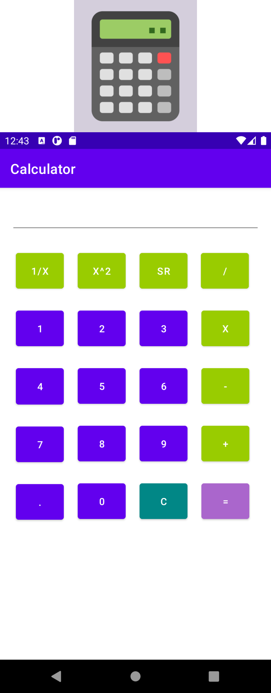

# :zap: Basic Calculator in Android Studio

App creada usando [Android studio](https://developer.android.com/), usando el lenguaje Java, y Gradle.

## :page_facing_up: Tabla de contenidos

* [Información general](#general-info)
* [Screenshots](#screenshots)
* [Technologías](#technologias)
* [Disposición](#Disposición)
* [Inspiración](#inspiración)
* [Contacto](#contacto)

## :books: Información general
#Clases
* MainActivity

#Funcionamiento
* En la calculadora se pueden realizar 7 operaciones:
* Sumar (+), 
* Restar (-),
* Multiplicar (*),
* Dividir (/),
* Raíz Cuadrada (SR),
* Cuadrado de un número (X^2),
* Inverso de un número (1/X)

## :camera: Screenshots

## :signal_strength: Tecnologías

* [Android Studio 4.1](https://developer.android.com/)
* [Java 8](https://www.oracle.com/index.html)
* [Gradle ](https://gradle.org/)

## :floppy_disk: Disposición

* Descargar APK

## 📦 APK

* [Descargar](https://epnecuador-my.sharepoint.com/:u:/g/personal/miguel_jurado_epn_edu_ec/ES1OVpXJSRVGu46gSlylzBUBIBvxkRtRDUwBzvrlJfwxjA?e=ewK6U4)

## :clap: Inspiración

* Proyecto inspirado en [technobyte - Build a Simple Android Calculator App in 5 Steps – Full code tutorial and explanation'](https://technobyte.org/simple-calculator-app-in-android-studio/)

## :envelope: Contacto 

* Repo creado por [Miguel - 0988185518]
